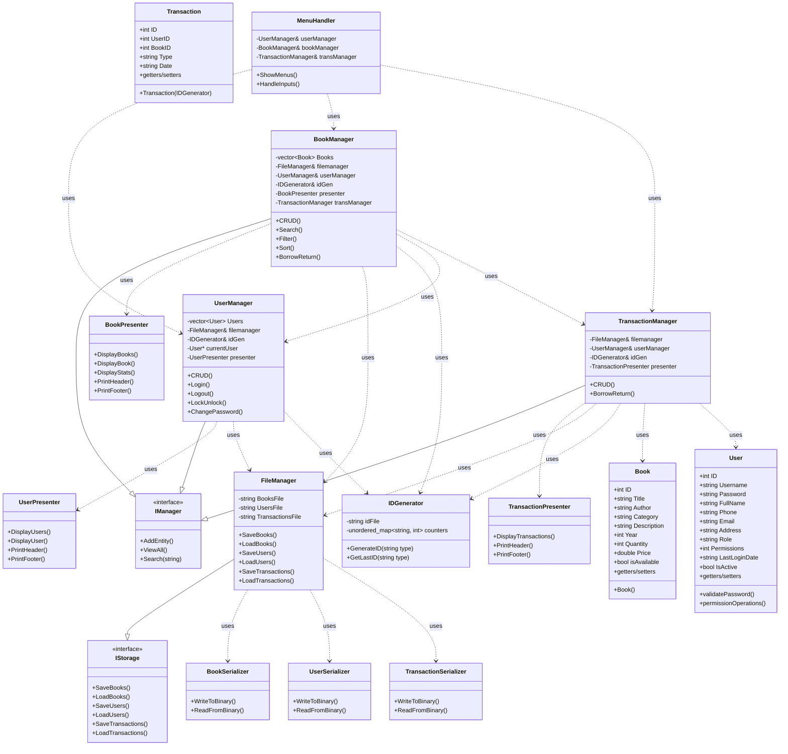

\# 📚 Book Management System

!\[C++](https://img.shields.io/badge/Language-C++17-blue?style=flat-square)

!\[Visual Studio](https://img.shields.io/badge/IDE-Visual\_Studio\_2022-purple?style=flat-square)

!\[Build](https://img.shields.io/badge/Build-Passing-brightgreen?style=flat-square)

!\[License](https://img.shields.io/badge/License-MIT-green?style=flat-square)

---

\## 🔹 Introduction

A robust, object-oriented C++ application for managing a library's books, users, and transactions.  

Demonstrates \*\*OOP\*\* \& \*\*OOD\*\* principles with a modular, scalable, and maintainable design.  

---

\## 🔹 Key Features

\- \*\*Book Management\*\*: Add, remove, search, and update books.

\- \*\*User Management\*\*: Register users with role-based permissions (Admin, User, Guest).

\- \*\*Transaction Management\*\*: Borrow/return books with transaction logging and ID generation.

\- \*\*Security \& Validation\*\*: Password encryption, strength checking, and authentication system.

\- \*\*Data Persistence\*\*: Binary `.bin` files for storing books, users, and transactions.

\- \*\*Menu-Driven Interface\*\*: Console UI with input validation and easy navigation.

---

\## 🔹 System Design \& Architecture

\- \*\*Separation of Concerns (SoC)\*\*: Core logic is separated into managers (`BookManager`, `UserManager`, `TransactionManager`) for single-responsibility.

\- \*\*OOP Principles\*\*:

&nbsp; - \*\*Encapsulation\*\*: Private data members with public interfaces.

&nbsp; - \*\*Inheritance \& Polymorphism\*\*: Base interfaces for extensible manager classes.

&nbsp; - \*\*Composition over Inheritance\*\*: Presenters compose managers for display logic.

\- \*\*Modular Layers\*\*: 

&nbsp; - \*\*Model\*\*: Data classes (`Book`, `User`)

&nbsp; - \*\*Service\*\*: Managers for business logic

&nbsp; - \*\*Presenter\*\*: UI handling

&nbsp; - \*\*Persistence\*\*: Serializers for I/O

\- \*\*Error Handling \& Security\*\*: Custom exceptions, password encryption, input sanitization.

\- \*\*Design Patterns\*\*: Observer-like updates for transactions, Factory for ID generation, Strategy for serialization.

---

## 🔹 UML Class Diagram - Book Management System

---

\## 🔹 Technologies \& Tools

\- \*\*Language\*\*: C++17 (Standard Library)

\- \*\*IDE\*\*: Visual Studio 2022 (x64)

\- \*\*Build System\*\*: MSVC, CMake-ready structure

\- \*\*Libraries\*\*: Standard C++ (no external dependencies)

---

\## 🔹 How to Build and Run

1\. Clone the repository:

&nbsp;  git clone https://github.com/Ahmed-Elhagein/Book-Management-System

2\. Open in Visual Studio:

&nbsp;  - Navigate to the cloned folder: Book-Management-System.

&nbsp;  - Open BookManagementSystem.vcxproj (or BookManagementSystem.sln if available).

&nbsp;  - Set configuration to x64 Debug (or Release) in the top toolbar.

3\. Build:

&nbsp;  - Press Ctrl+Shift+B or Build > Build Solution

&nbsp;  - Executable appears in x64/Debug/

4\. Run:

&nbsp;  - Execute BookManagementSystem.exe

&nbsp;  - Follow the console menu to manage books, users, and transactions

---

\## 🔹 Sample Data

\- books.bin: Sample books

\- users.bin: Default admin (UserName: Ahmed, Password: Ahmed@1234) \& Default User (UserName: Sayed, Password:  Sayed@1234)

\- transactions.bin \& ids.bin: Empty for new sessions

---

\## 🔹 Future Enhancements

\- GUI integration (e.g., Qt)

\- SQLite database migration

\- REST API for web integration

\- Unit tests using Google Test

---

\## 🔹 About the Developer

Project developed by Ahmed Elhagein, 2025.

Showcases expertise in system design, OOP, and OOD, with clean, scalable code.

\*\*Connect with me:\*\*  

\[LinkedIn](https://www.linkedin.com/in/ahmed-elhagein-3b835731a) | \[GitHub](https://github.com/Ahmed-Elhagein)

